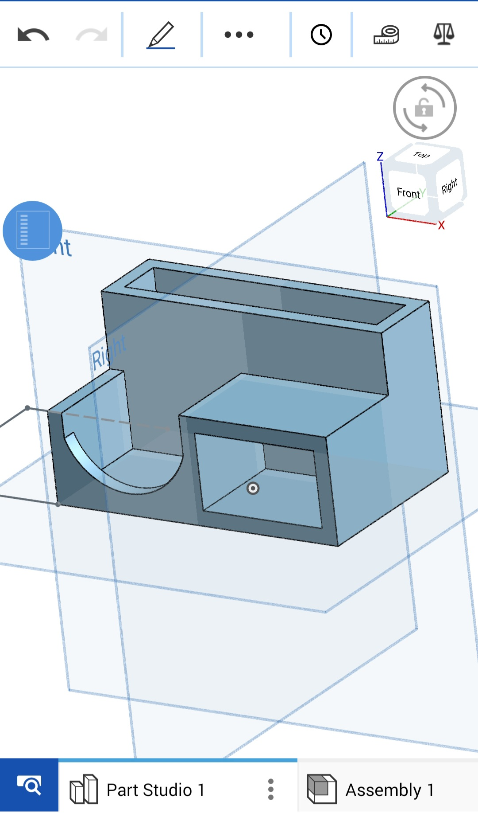

# Wed 23 Sept: I have started the 3d model

I have started this simple mobile cad project. Im making a simple stationary holder that is genuinely useful. I have added a total of 3 sections so far which took my 40 mins as i was getting used to the onshape mobile interface. However i think i will be able to make models much quicker now as im getting used to the ui. This is what the model looks like so far:

**total time spent: 40 mins**
